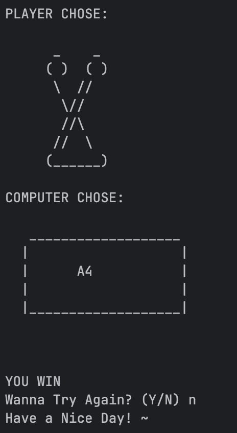

<h1 align="center">ZygmaCore Rock-Paper-Scissors</h1>

<p align="center">
  
  
  
</p>

<p align="center">
  
</p>

<h3 align="center">
  A simple Python CLI Rock-Paper-Scissors game with ASCII art and clean outcome logic.
</h3>

---

## 📘 About The Project

This project is a **terminal-based Rock-Paper-Scissors game** built using Python.  
It uses **ASCII art**, clean input handling, and proper game logic to determine who wins each round.

The user selects Rock, Paper, or Scissors, the computer randomly selects its choice, and the program displays the winner with visual output.

### 🎯 Why This Project Exists

Most beginners build simple RPS games without visuals.  
This version adds:

- ASCII art
- cleaner logic
- replay loop
- variable mapping system  
so it becomes more fun **and** better structured for learning.

It’s perfect as a **beginner-friendly Python mini project** and a **starter portfolio piece**.

---

## 🖼 Screenshot



---

## 🛠 Tech Stack

| Technology | Usage |
|-----------|--------|
| 🐍 **Python** | Core programming language |
| 🎨 **ASCII Art** | Enhanced visual gameplay |
| 🎲 **random** | Generates computer choice |
| 💻 **CLI / Terminal** | User interaction |

---

## ✨ Key Features

- ✊✋✌️ **ASCII Art Style RPS**
- 🤖 **Smart Computer Choice** (randomized)
- 🧠 **Clean Win Logic** using name mapping
- 🔁 **Replay System** (play again without restarting)
- 🚫 **Input Validation**
- 🧹 **Screen Clearing** for clean UI (`os.system("clear")`)

---

## 🚀 Getting Started

### ✅ Prerequisites

You need:

- Python **3.8+**
- Terminal (MacOS, Linux, Windows PowerShell/CMD)

---

### 📦 Installation

Clone repository:

```bash
git clone https://github.com/ZygmaCore/rock_paper_scissors.git
cd rock_paper_scissors
```

(Optional) Create virtual environment:

```bash
python -m venv .venv
# macOS/Linux
source .venv/bin/activate
# Windows
.venv\Scripts\activate
```

---

### ▶️ Usage

Run the game:

```bash
python main.py
```

Sample gameplay:

```
Please Press ENTER To Play the Game!

What do you choose? Type 0 for Rock, 1 for Paper or 2 for Scissors.

PLAYER CHOSE:
[ASCII ART]

COMPUTER CHOSE:
[ASCII ART]

YOU WIN
```

---

## 🤝 Contributing

Contributions are always welcome!

1. Fork the project  
2. Create a branch (`git checkout -b feature-name`)  
3. Commit your changes  
4. Push to your branch  
5. Open a pull request  

---

## 📄 License & Contact

This project is licensed under the **MIT License**.
See the `LICENSE` file for full details.

**Author Contact:**  
🌐 https://alhikam.me
🐙 https://github.com/ZygmaCore
